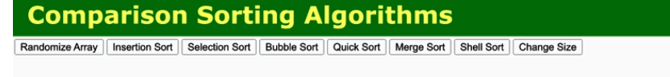

type NameVar = TypeData

- modify your compilation command to include the necessary library: cc hello.c -o hello -lcs50
- check C library installed: dpkg-query -l NameLibrary
- %% > %
- no need to use { } if there is only 1 statement in the if statement
- any # 0 >>> true
- định nghĩa hàm ở cuối hoặc ngay sau chương trình và sau đó đưa phần tên hàm lên trước chương trình có chứa hàm cần chạy
- truncation, type casting
- long vs int | float vs double

=== LECTURE 2: ARRAYS ===
- Clang (GCC) for C
- preprocessing >>> compiling >>> assembling >>> linking (link any binary file together, include MyFile.c, cs50.c, stdio.c,...)
- some a way to debugging: printf, debugger, rubber duck
- research debug tools
- for (int i = 0, n = something; i < n; i++) >>> best design
- plaintext >>> cipher >>> ciphertext

???
- gặp vấn đề khi thao tác với trình gỡ lỗi

=== LECTURE 3: ALGORITHMS ===
- upper bound and lower bound
- 

=== LECTURE 4: MEMORY ===
- strings are the address of the first character in that sequence of characters
- không gọi hàm khi cần thiết nếu câu trả lời luôn luôn giống nhau
- khi yêu cầu cấp pháp bộ nhớ >>> sử dụng xong >>> trả lại bộ nhớ
- fix bug: valgrind
- garbage values
- use swap to permutation

=== LECTURE 5: DATA STRUCTURES ===
- abstract data types
    - first in, first out (FIFO)
    - stacks
    - queue (enqueue, dequeue)
    - last in first out (LIFO)
    - linked lists
    - trees
    - dictionaries
    - hashing & hash table
    - tries

=== LECTURE 5: PYTHON ===
- pythonic what is mean?
- python allows you to use a variable any time after you have assigned it a value.
- scores.append(score) = scores += [score]
    
???
- re watch resizing arrays
- what is two-dimensional array
- node what it is?

???
- what is bitmap
- what is the pointer
- re-watch part copy of video
- trong lập trình, tại sao lại cần phải dùng swap?

???
- if (c == 'y' || c == 'Y'), trông câu lệnh trên, tại sao khi nhập `sdfsdf` thì chương trình vẫn được keep, trong khi nhập `f` hay `2`, đại loại là 1 ký tự bất kỳ ngoài y và Y thì chương trình lại thoát

what is main (void)?

